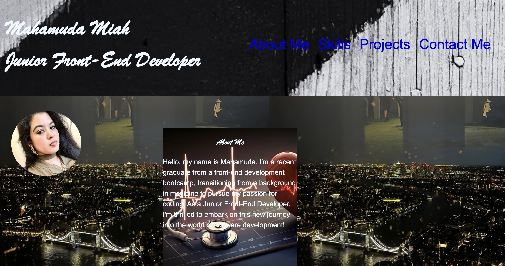

# My Portfolio 

## Sculpting stories, forging futures

## Description

Welcome to my first portfolio! This project serves as a showcase of my skills, projects, and contact information. As a Junior Front-End Developer, I'm enthusiastic about web development and committed to crafting visually appealing and user-friendly experiences.

## Portfolio Link

You can access my portfolio [here](https://m-maha21.github.io/sculpting-stories-forging-futures/).

## Screenshot

## Table of Contents 

- [Description](#description)
- [Portfolio Link](#portfoliolink)
- [Screenshot](#screenshot)
- [Installation](#installation)
- [usage](#usage)
- [License](#license)
- [Contribution](#contribution)
- [Credits](#credits)
- [Tools](#tools)

## Installation

N/A

## Usage

Feel free to explore my portfolio to learn more about my skills, check out my projects, and get in touch with me. Simply click on the links provided in each section to navigate through the different pages.

## License
N/A

## Contribution

N/A

## Credits

Name: Mahamuda
GitHub: m-maha21

## Tools

The tools that I have used in project are: HTML, CSS & GitHub 